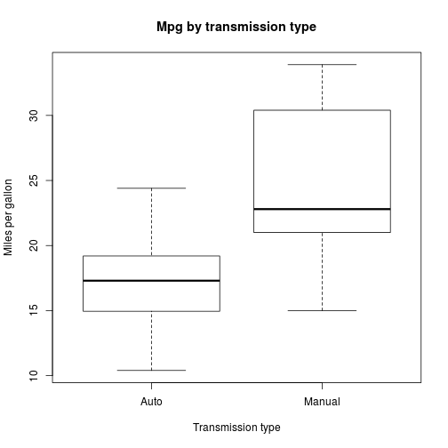
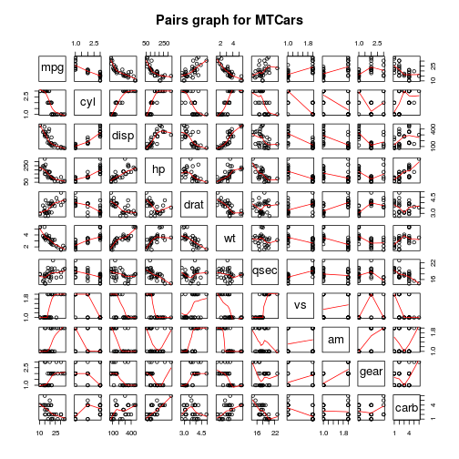
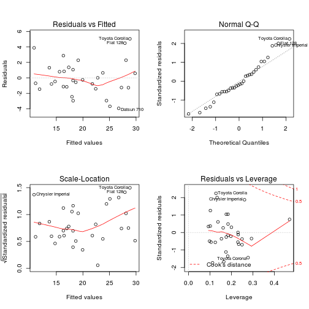

## Load libraries

```r
library(knitr)
library(markdown)
```
## Loading data from mtcars dataset

```r
data(mtcars)
str(mtcars)
```

```
## 'data.frame':	32 obs. of  11 variables:
##  $ mpg : num  21 21 22.8 21.4 18.7 18.1 14.3 24.4 22.8 19.2 ...
##  $ cyl : num  6 6 4 6 8 6 8 4 4 6 ...
##  $ disp: num  160 160 108 258 360 ...
##  $ hp  : num  110 110 93 110 175 105 245 62 95 123 ...
##  $ drat: num  3.9 3.9 3.85 3.08 3.15 2.76 3.21 3.69 3.92 3.92 ...
##  $ wt  : num  2.62 2.88 2.32 3.21 3.44 ...
##  $ qsec: num  16.5 17 18.6 19.4 17 ...
##  $ vs  : num  0 0 1 1 0 1 0 1 1 1 ...
##  $ am  : num  1 1 1 0 0 0 0 0 0 0 ...
##  $ gear: num  4 4 4 3 3 3 3 4 4 4 ...
##  $ carb: num  4 4 1 1 2 1 4 2 2 4 ...
```
## Setting up the variables and levels for Auto and Manual transmission

```r
mtcars$cyl <- factor(mtcars$cyl)
mtcars$vs <- factor(mtcars$vs)
mtcars$gear <- factor(mtcars$gear)
mtcars$carb <- factor(mtcars$carb)
mtcars$am <- factor(mtcars$am)
levels(mtcars$am) <- c("Auto", "Manual")
```
## Performing Student t-test and Wilcox test

```r
t.test(mpg ~ am, data = mtcars)
```

```
## 
## 	Welch Two Sample t-test
## 
## data:  mpg by am
## t = -3.7671, df = 18.332, p-value = 0.001374
## alternative hypothesis: true difference in means is not equal to 0
## 95 percent confidence interval:
##  -11.280194  -3.209684
## sample estimates:
##   mean in group Auto mean in group Manual 
##             17.14737             24.39231
```

```r
wilcox.test(mpg ~ am, data = mtcars)
```

```
## Warning in wilcox.test.default(x = c(21.4, 18.7, 18.1, 14.3, 24.4, 22.8, :
## cannot compute exact p-value with ties
```

```
## 
## 	Wilcoxon rank sum test with continuity correction
## 
## data:  mpg by am
## W = 42, p-value = 0.001871
## alternative hypothesis: true location shift is not equal to 0
```

## Fitting a linear model with the mtcars dataset

```r
model.all <- lm(mpg ~ ., data = mtcars)
model <- step(model.all)
```

```
## Start:  AIC=76.4
## mpg ~ cyl + disp + hp + drat + wt + qsec + vs + am + gear + carb
## 
##        Df Sum of Sq    RSS    AIC
## - carb  5   13.5989 134.00 69.828
## - gear  2    3.9729 124.38 73.442
## - am    1    1.1420 121.55 74.705
## - qsec  1    1.2413 121.64 74.732
## - drat  1    1.8208 122.22 74.884
## - cyl   2   10.9314 131.33 75.184
## - vs    1    3.6299 124.03 75.354
## <none>              120.40 76.403
## - disp  1    9.9672 130.37 76.948
## - wt    1   25.5541 145.96 80.562
## - hp    1   25.6715 146.07 80.588
## 
## Step:  AIC=69.83
## mpg ~ cyl + disp + hp + drat + wt + qsec + vs + am + gear
## 
##        Df Sum of Sq    RSS    AIC
## - gear  2    5.0215 139.02 67.005
## - disp  1    0.9934 135.00 68.064
## - drat  1    1.1854 135.19 68.110
## - vs    1    3.6763 137.68 68.694
## - cyl   2   12.5642 146.57 68.696
## - qsec  1    5.2634 139.26 69.061
## <none>              134.00 69.828
## - am    1   11.9255 145.93 70.556
## - wt    1   19.7963 153.80 72.237
## - hp    1   22.7935 156.79 72.855
## 
## Step:  AIC=67
## mpg ~ cyl + disp + hp + drat + wt + qsec + vs + am
## 
##        Df Sum of Sq    RSS    AIC
## - drat  1    0.9672 139.99 65.227
## - cyl   2   10.4247 149.45 65.319
## - disp  1    1.5483 140.57 65.359
## - vs    1    2.1829 141.21 65.503
## - qsec  1    3.6324 142.66 65.830
## <none>              139.02 67.005
## - am    1   16.5665 155.59 68.608
## - hp    1   18.1768 157.20 68.937
## - wt    1   31.1896 170.21 71.482
## 
## Step:  AIC=65.23
## mpg ~ cyl + disp + hp + wt + qsec + vs + am
## 
##        Df Sum of Sq    RSS    AIC
## - disp  1    1.2474 141.24 63.511
## - vs    1    2.3403 142.33 63.757
## - cyl   2   12.3267 152.32 63.927
## - qsec  1    3.1000 143.09 63.928
## <none>              139.99 65.227
## - hp    1   17.7382 157.73 67.044
## - am    1   19.4660 159.46 67.393
## - wt    1   30.7151 170.71 69.574
## 
## Step:  AIC=63.51
## mpg ~ cyl + hp + wt + qsec + vs + am
## 
##        Df Sum of Sq    RSS    AIC
## - qsec  1     2.442 143.68 62.059
## - vs    1     2.744 143.98 62.126
## - cyl   2    18.580 159.82 63.466
## <none>              141.24 63.511
## - hp    1    18.184 159.42 65.386
## - am    1    18.885 160.12 65.527
## - wt    1    39.645 180.88 69.428
## 
## Step:  AIC=62.06
## mpg ~ cyl + hp + wt + vs + am
## 
##        Df Sum of Sq    RSS    AIC
## - vs    1     7.346 151.03 61.655
## <none>              143.68 62.059
## - cyl   2    25.284 168.96 63.246
## - am    1    16.443 160.12 63.527
## - hp    1    36.344 180.02 67.275
## - wt    1    41.088 184.77 68.108
## 
## Step:  AIC=61.65
## mpg ~ cyl + hp + wt + am
## 
##        Df Sum of Sq    RSS    AIC
## <none>              151.03 61.655
## - am    1     9.752 160.78 61.657
## - cyl   2    29.265 180.29 63.323
## - hp    1    31.943 182.97 65.794
## - wt    1    46.173 197.20 68.191
```

```r
summary(model)
```

```
## 
## Call:
## lm(formula = mpg ~ cyl + hp + wt + am, data = mtcars)
## 
## Residuals:
##     Min      1Q  Median      3Q     Max 
## -3.9387 -1.2560 -0.4013  1.1253  5.0513 
## 
## Coefficients:
##             Estimate Std. Error t value Pr(>|t|)    
## (Intercept) 33.70832    2.60489  12.940 7.73e-13 ***
## cyl6        -3.03134    1.40728  -2.154  0.04068 *  
## cyl8        -2.16368    2.28425  -0.947  0.35225    
## hp          -0.03211    0.01369  -2.345  0.02693 *  
## wt          -2.49683    0.88559  -2.819  0.00908 ** 
## amManual     1.80921    1.39630   1.296  0.20646    
## ---
## Signif. codes:  0 '***' 0.001 '**' 0.01 '*' 0.05 '.' 0.1 ' ' 1
## 
## Residual standard error: 2.41 on 26 degrees of freedom
## Multiple R-squared:  0.8659,	Adjusted R-squared:  0.8401 
## F-statistic: 33.57 on 5 and 26 DF,  p-value: 1.506e-10
```
## Fitting an ANOVA model

```r
model0 <- lm(mpg ~ am, data = mtcars)
anova(model0, model)
```

```
## Analysis of Variance Table
## 
## Model 1: mpg ~ am
## Model 2: mpg ~ cyl + hp + wt + am
##   Res.Df    RSS Df Sum of Sq      F    Pr(>F)    
## 1     30 720.90                                  
## 2     26 151.03  4    569.87 24.527 1.688e-08 ***
## ---
## Signif. codes:  0 '***' 0.001 '**' 0.01 '*' 0.05 '.' 0.1 ' ' 1
```
## Calculating leverage 
An observation that has an unusual X value—i.e., it is far from the mean of X—has leverage on (i.e., the potential to influence) the regression line 

```r
leverage <- hatvalues(model)
leverage[which(leverage > 0.5)]
```

```
## named numeric(0)
```

## Calculating influential
Only when an observation has high leverage and is an outlier in terms of Y-value will it strongly influence the regression line

```r
influential <- dfbetas(model)
influential[which(abs(influential) > 1)]
```

```
## numeric(0)
```
## Quantifying the MPG difference between automatic and manual transmissions

```r
plot(mpg ~ am, data = mtcars, main = "Mpg by transmission type", xlab = "Transmission type", ylab = "Miles per gallon")
```

 

```r
pairs(mtcars, panel = panel.smooth, main = "Pairs graph for MTCars")
```

 

```r
par(mfrow = c(2, 2))
plot(model)
```

 
